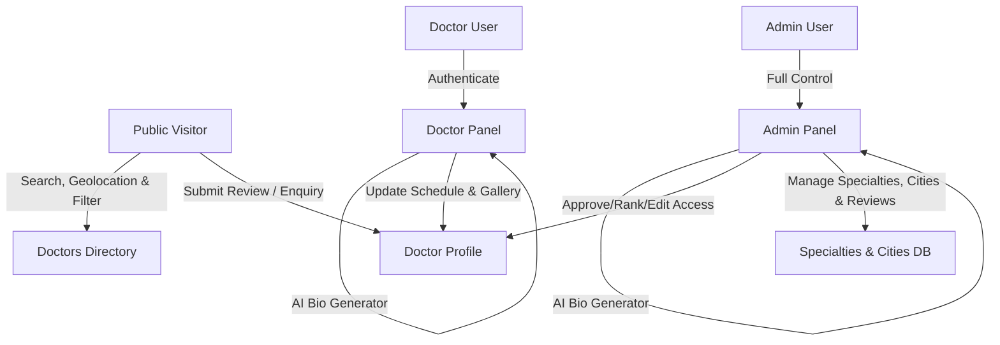

# 🩺 DrMap — Advanced Doctor Directory & Healthcare Locator Platform

DrMap is a healthcare directory web application designed to connect patients with medical specialists. It includes an interactive public portal, a dedicated doctor self-management portal, and an administrative dashboard. Powered by a responsive Tailwind CSS interface, custom interactive mapping, patient reviews, geolocation proximity sorting, and AI-assisted professional bio generation.

---

## 🚀 Key Features

### 🌐 Public Portal & Patient Experience
- **Geolocation & Nearest Doctor Search:** Prompts browser geolocation permission to automatically detect patient location, calculate real-time distance using the Haversine formula, match the user to the nearest active city, and sort doctors by proximity.
- **Advanced Search & Filtering:** Filter doctors by specialty, city, availability status, ratings, and hospital associations.
- **Dynamic Profile Pages:** Profiles featuring interactive schedules, photo galleries, video links, patient reviews, and dual clinic location maps.
- **Dual Clinic Maps:** Interactive OpenStreetMap / Leaflet.js maps supporting primary and secondary practice locations with direct navigation guidance.
- **Enquiry System:** Patients can send direct consultation enquiries and messages to practitioners.
- **Patient Review System:** Ratings (1–5 stars) and written testimonials directly submitted on doctor profiles with administrative moderation.

### 💼 Doctor Portal (`/doctorpanel`)
- **Self-Management:** Direct portal for practitioners to manage their profile details, qualifications, time slot schedules, profile photo, and clinic gallery images.
- **🤖 AI Bio Generator:** Integrated AI bio tool to generate professional, tailored biographies based on doctor name, specialty, qualification, and years of experience.
- **Enquiry Manager:** Dashboard for doctors to view and track patient consultation enquiries.
- **Access Control:** Profile editing access can be enabled or disabled per doctor account by system administrators.

### 🛡️ Administrative Dashboard (`/admin`)
- **Complete Moderation:** Full CRUD operations on doctors, hospital associations, specialties, cities, reviews, and enquiries.
- **🤖 AI Bio Generator:** Embedded AI description generator for drafting doctor profile biographies during creation and editing.
- **Doctor Ranking & Priority:** Custom ranking/weight system to control visibility priority and pin featured doctors on search listings and the homepage.
- **Specialty Icon Management:** Upload custom icon assets (PNG, SVG, JPG, WEBP) or select FontAwesome icon classes for medical specialties.
- **City CRUD & Coordinate Setup:** Add and manage cities with GPS coordinates for geographic filtering.
- **Review Moderation:** Review approval and moderation workflow.

### 📜 Legal & Compliance Pages
- **Privacy Policy:** Dedicated privacy policy page (`privacy-policy.php`).
- **Terms of Service:** Dedicated terms of service page (`terms-of-service.php`).
- **Cookie Policy:** Dedicated cookie consent and policy information page (`cookie-policy.php`).

---

## 🛠️ Tech Stack & Architecture

- **Backend:** PHP 8.x (Vanilla PHP, OOP, PDO Database Abstraction)
- **Frontend:** Tailwind CSS, JavaScript (ES6), FontAwesome 6 Icons
- **Database:** MySQL / MariaDB (Structured InnoDB tables with prepared statements)
- **Mapping & Geolocation:** Leaflet.js & OpenStreetMap for dual clinic pin dropping, reverse geolocation matching, and distance matrix calculations
- **AI Module:** Template-assisted parameter-driven AI bio generator (`ai_write_bio.php`)



---

## 📁 Directory Structure

```text
doctor/
├── admin/                     # Administrative Dashboard
│   ├── inc/                   # Sidebar, Header, and DB configuration
│   ├── add.php                # Add new doctor profile
│   ├── ai_write_bio.php       # AI bio generator endpoint
│   ├── cities.php             # City CRUD & coordinate management
│   ├── doctors.php            # Doctor account management & ranking list
│   ├── edit.php               # Doctor editor with dual clinic maps & AI bio
│   ├── enquiries.php          # Contact enquiry management
│   ├── hospitals.php          # Hospital association CRUD
│   ├── reviews.php            # Patient review moderation workflow
│   ├── specialties.php        # Specialty CRUD with custom icon upload
│   └── view.php               # Admin detailed doctor profile view
├── doctorpanel/               # Doctor Dashboard Portal
│   ├── inc/                   # Navigation and doctor header components
│   ├── edit.php               # Self-management editor with AI bio & schedule editor
│   ├── enquiries.php          # Doctor enquiry inbox
│   ├── login.php              # Doctor authentication portal
│   └── view.php               # Doctor profile overview panel
├── inc/                       # Shared public components
│   └── footer.php             # Footer with dynamic multi-column specialty navigation
├── uploads/                   # Uploaded image assets & icons
│   ├── doctors/               # Doctor gallery & profile images
│   └── specialties/           # Uploaded specialty icons
├── index.php                  # Homepage with search, top doctors, and specialty grid
├── doctors.php                # Directory Search/Filter page with geolocation proximity sorting
├── doctor-profile.php         # Public doctor profile page with dual maps and reviews
├── privacy-policy.php         # Privacy Policy page
├── terms-of-service.php       # Terms of Service page
├── cookie-policy.php          # Cookie Policy page
├── save_enquiry.php           # Patient enquiry submission handler
├── submit_review.php          # Patient review submission handler
├── run_migration.php          # Database schema auto-updater
└── README.md                  # Project documentation
```

---

## ⚙️ Installation & Setup

Follow these steps to set up and run DrMap on **XAMPP / WAMP** or any local PHP web server:

### 1. Clone & Place Project
Clone this repository into your local web server root directory (e.g., `C:\xampp\htdocs\doctor\`):
```bash
git clone https://github.com/codemuji/drmap.git
```

### 2. Set Up Database
1. Open **phpMyAdmin** (`http://localhost/phpmyadmin`).
2. Create a new database named `DrMap` with collation `utf8mb4_general_ci`.
3. Run schema setup and database migrations by navigating to:
   `http://localhost/doctor/run_migration.php`

### 3. Database Credentials
To configure custom hosting credentials, edit `/admin/inc/db.php`:
```php
define('DB_HOST', 'localhost');
define('DB_NAME', 'DrMap');
define('DB_USER', 'root');
define('DB_PASS', '');
```

### 4. Admin Access
Log in to the Admin Dashboard using:
- **URL:** `http://localhost/doctor/admin/login.php`
- **Email:** `admin@drmap.com`

---

## 🔒 Security & Best Practices
- **Prepared SQL Statements:** All database queries utilize PDO prepared statements to protect against SQL Injection.
- **Password Hashing:** BCRYPT encryption for admin and doctor account credentials.
- **Dynamic File Validation:** Image uploads undergo MIME-type checking, file size validation, and safe path isolation.
- **Review Moderation:** Patient reviews undergo admin review before publication on public doctor profiles.
