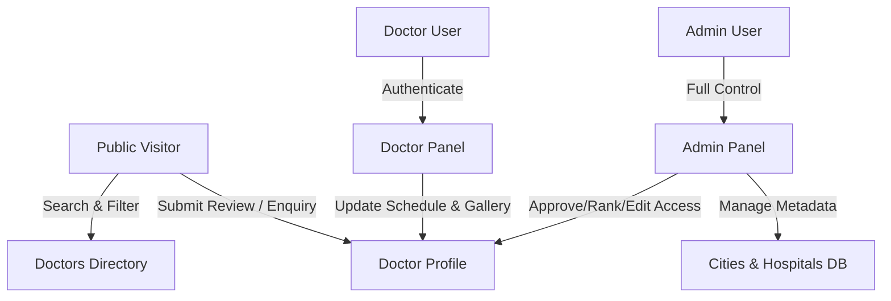

# 🩺 DrMap — Advanced Doctor Directory & Healthcare Locator Platform

DrMap is a premium, feature-rich healthcare web application designed to connect patients with doctors. It includes an interactive public portal, a dedicated doctor management portal, and a powerful administrative dashboard. Powered by a responsive Tailwind CSS interface, custom interactive mapping, database tracking, and AI-assisted professional bio creation.

---

## 🚀 Key Features

### 🌐 Public Portal
- **Advanced Search & Filtering:** Filter doctors by specialty, city, availability status, ratings, and hospital associations.
- **Dynamic Profile Pages:** Rich profiles featuring interactive schedules, photo galleries, video links, patient reviews, and clinic location maps.
- **Enquiry System:** Patients can send direct consultation enquiries/messages to doctors.
- **Patient Review System:** Ratings and written testimonials directly submitted on the doctor's profile.

### 💼 Doctor Portal (`/doctorpanel`)
- **Self-Management:** Direct login for practitioners to update their personal details, professional qualifications, time slot schedules, and profile photo/gallery.
- **Enquiry Manager:** View and response tracking for enquiries sent by patients.

### 🛡️ Administrative Dashboard (`/admin`)
- **Complete Moderation:** Full CRUD operations on doctors, hospital associations, specialties, cities, and reviews.
- **Access Control:** Toggle doctor edit access permissions dynamically.
- **Advanced Ranking:** Custom doctor ranking/weight system to control visibility priority on the homepage list.
- **🤖 AI Bio Generator:** Leverages integrated AI API to automatically draft professional bios for doctors based on their experience and specialty.

---

## 🛠️ Tech Stack & Architecture

- **Backend:** PHP 8.x (Vanilla, OOP, PDO Database Layer)
- **Frontend:** Tailwind CSS (CDN config), Javascript (ES6), FontAwesome 6 (Icons)
- **Database:** MySQL / MariaDB (Structured InnoDB tables)
- **APIs & Integrations:** AI-assisted biography generation, Leaflet.js / OpenStreetMap for GPS pins and location picking.



---

## 📁 Directory Structure

```text
doctor/
├── admin/                     # Administrative Dashboard
│   ├── inc/                   # Sidebar, Header, head styles
│   ├── ai_write_bio.php       # AI bio writer endpoint
│   ├── doctors.php            # Doctor accounts lists
│   ├── edit.php               # Doctor editor with map/data options
│   └── enquiries.php          # Contact message reviewer
├── doctorpanel/               # Doctor Dashboard Portal
│   ├── inc/                   # Navigation components
│   └── edit.php               # Portal editor (permission controlled)
├── inc/                       # Shared public components
│   └── footer.php
├── uploads/                   # User and gallery uploaded assets
│   └── doctors/               # ID-based image directories
├── index.php                  # Public Home Directory Page
├── doctors.php                # Directory Search/Filter page
├── doctor-profile.php         # Public profile landing page
├── index.css                  # Custom styling and animations
├── run_migration.php          # Database schema auto-updater
└── README.md                  # Documentation (this file)
```

---

## ⚙️ Installation & Setup

Follow these steps to run DrMap locally on **XAMPP / WAMP**:

### 1. Clone & Place Project
Clone this repository directly into your local web server root directory:
```bash
git clone https://github.com/codemuji/drmap.git
```
*(Ensure target path is `C:\xampp\htdocs\doctor\` or equivalent).*

### 2. Set Up Database
1. Open **phpMyAdmin** (`http://localhost/phpmyadmin`).
2. Create a new database named `DrMap` with collation `utf8mb4_general_ci`.
3. Import the base table SQL schema or upgrades files:
   - Run `run_migration.php` via browser (`http://localhost/doctor/run_migration.php`) to automatically generate and migrate schemas.

### 3. Connection Settings
To update hosting credentials, edit the connection constants inside `/admin/inc/db.php`:
```php
define('DB_HOST', 'localhost');
define('DB_NAME', 'DrMap');
define('DB_USER', 'root');
define('DB_PASS', '');
```

### 4. Admin Access
Log in to the Admin Panel using the credentials:
- **URL:** `http://localhost/doctor/admin/login.php`
- **Email:** `admin@drmap.com`
- **Default password:** *(Obtain standard hash/credentials inside `admin_users` table).*

---

## 🔒 Security & Best Practices
- **Prepared SQL Statements:** All queries leverage PDO parameters to completely protect against SQL Injection.
- **Password Hashing:** BCRYPT encryption is standard for all admin users and doctor credentials.
- **Dynamic File Validations:** Image uploads undergo strict type checking, file size constraints, and custom path isolation to secure the uploads directory.
